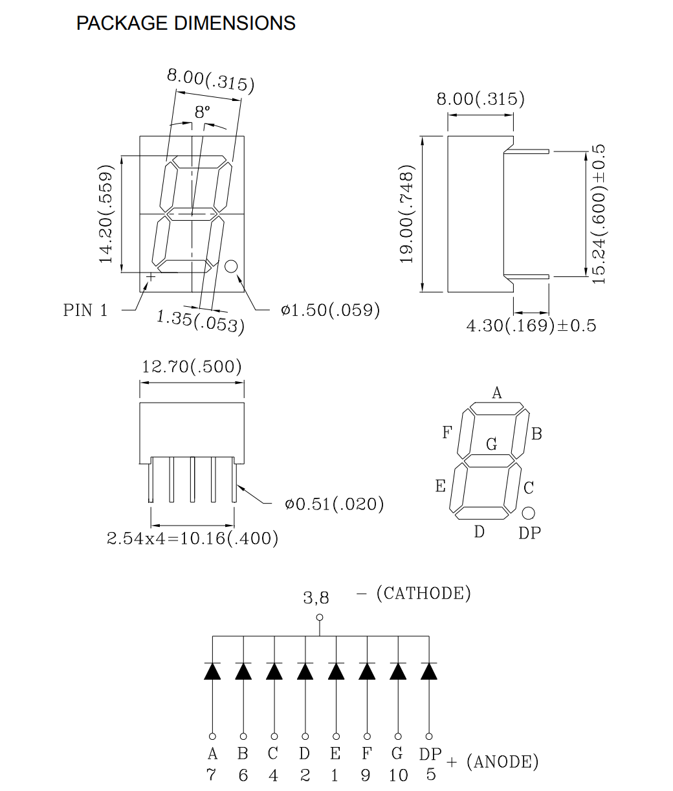
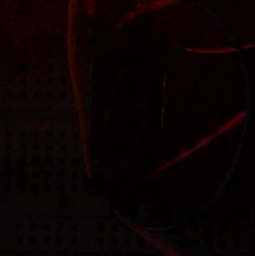

# 概要

カソードコモンの7セグメントLEDで数字を表示するライブラリです。

[使用したLEDのデータシート](https://akizukidenshi.com/download/ds/paralight/C-551SRD.pdf)

# 使い方

各開発環境(Mbed Compiler, Mbed Studio, PlatformIO, etc...)に、このライブラリをインポートして下さい。

# リファレンス

## 初期化

```cpp
SevenSegmentLed name(PinName a, PinName b, PinName c, PinName d, PinName e, PinName f, PinName g, PinName dp);
```

| name             | インスタンス名          |
| ---------------- | ---------------- |
| **PinName a~dp** | **a~dpに対応するpin（データシート参照）** |

> 
>
> データシートより引用（[https://akizukidenshi.com/download/ds/paralight/C-551SRD.pdf](https://akizukidenshi.com/download/ds/paralight/C-551SRD.pdf)）

## 数字出力

```cpp
name = 1~9;
name.write_number(1~9);
```

1~9の数字をLEDに表示させます。

## 数字出力（複数桁）

```cpp
name.scroll(unsigned int number);
name.scroll(double number, unsigned int significant_figures)
```

| unsigned int number                  | 表示する数値（整数）     |
| ------------------------------------ | -------------- |
| **double number**                    | **表示する数値（実数）** |
| **unsigned int significant_figures** |        **有効桁数**        |

複数桁の数値を上位桁から順に表示します。

```cpp
name.scroll(123456789);
```


```cpp
name.scroll(3.141592, 7);
```



## 表示間隔

| name.scroll_interval_ms | LED点滅の周期 |
|-|-|

`scroll`の点滅の間隔を指定します。（デフォルト500ms）

## 消灯

```cpp
name.off_led()
```

LEDをすべて消灯させます。

## サンプルコード

```cpp
#include "mbed.h"
#include "SevenSegmentLed.h"

SevenSegmentLed seg_led(D4, D5, D11, D7, D8, D9, D10, D12);

void rest()
{
    seg_led.off_led();
    ThisThread::sleep_for(1s);
}

int main()
{
    while (true)
    {
        seg_led.write_number(5);
        ThisThread::sleep_for(1s);
        rest();
        seg_led.scroll(123456789);
        rest();
        seg_led.scroll("3.141592");
        rest();
    }
}
```

